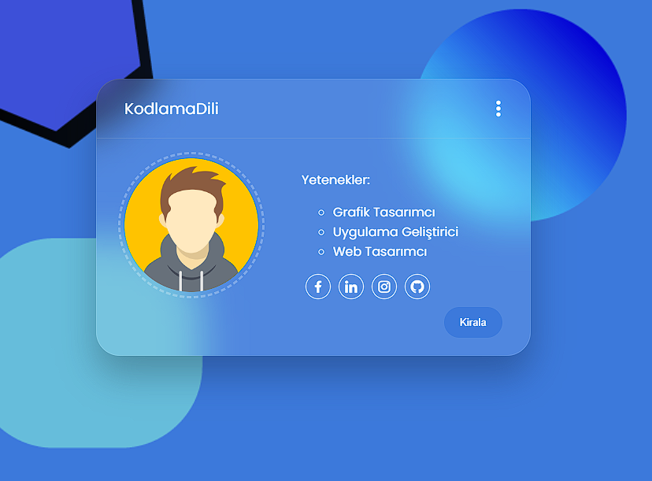

    # Glass Card Portfolio

Bu proje, basit bir HTML ve CSS kullanarak oluşturulmuş bir cam kart (glass card) şeklinde bulanık bir portföyü içerir.

## Proje Hakkında

Bu proje, HTML ve CSS kullanılarak geliştirilmiş bir portföy tasarımını içermektedir. Cam kart efekti ve bulanık arka plan, modern web tasarımında sıkça kullanılan öğelerden biridir.

## Nasıl Kullanılır

1. Projeyi bilgisayarınıza klonlayın veya [buraya tıklayarak](https://github.com/randyisback/glass-card-portfolio/archive/refs/heads/main.zip) indirin.
   
2. Dosyaları bir metin editörü veya geliştirme ortamında açın.
   
3. `index.html` dosyasını bir web tarayıcısında açarak sonucu görüntüleyin.

## Ekran Görüntüsü:

Projenin nasıl göründüğünü daha iyi anlamak için aşağıdaki ekran videosunu izleyebilirsiniz:
<!-- 
 -->

<iframe allow="fullscreen;autoplay" allowfullscreen height="100%" src="https://streamable.com/e/fdq40a?autoplay=1&muted=1" width="100%" style="border:none; width:100%; height:100%; position:absolute; left:0px; top:0px; overflow:hidden;"></iframe>

## Lisans

Bu proje GNU Affero General Public License v3.0 altında lisanslanmıştır. Daha fazla bilgi için [LICENSE](LICENSE) dosyasını inceleyebilirsiniz.
